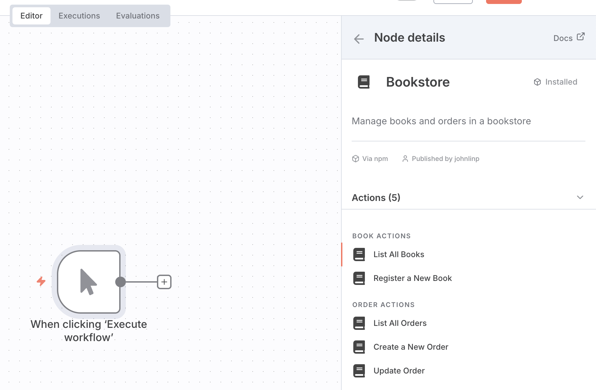

# n8n-nodes-bookstore

An example of n8n custom node that manages "resources" and "operations".
Here, I use "bookstore management system" as an example.

## Screenshots

### Search for the Bookstore node

### Bookstore actions

### Edit a Bookstore step

## How to install and run

Please see <https://docs.n8n.io/integrations/creating-nodes/test/run-node-locally/>.

